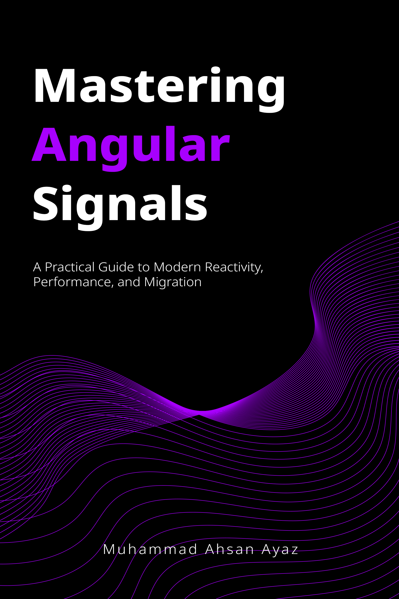

Find the book at: [Amazon](https://www.amazon.com/dp/B0FF9LSHJN/)

# Modern Angular - Mastering Angular Signals: Code Examples

This repository contains the source code examples for the book "Modern Angular - Mastering Angular Signals". Each chapter's code is organized into its own application within this Nx workspace.

Find the book at: [https://codewithahsan.dev/books](https://codewithahsan.dev/books)

## Prerequisites

Before you begin, ensure you have the following installed:
*   [Node.js](https://nodejs.org/) (LTS version recommended)
*   npm (comes with Node.js)

## Installation

1.  Clone the repository:
    ```bash
    git clone https://github.com/ahsanayaz/modern-angular-signals-book
    cd modern-angular-signals-book
    ```
2.  Install the dependencies:
    ```bash
    npm install
    ```

## Running Chapter Examples

This repository uses [Nx](https://nx.dev) to manage the monorepo structure. You can serve individual chapter applications using the following commands:

```bash
# Serve Chapter 1 application
npx nx serve chapter-01

# Serve Chapter 2 application
npx nx serve chapter-02

# Serve Chapter 3 application
npx nx serve chapter-03

# Serve Chapter 4 application
npx nx serve chapter-04

# Serve Chapter 5 application
npx nx serve chapter-05

# Serve Chapter 6 application
npx nx serve chapter-06

# Serve Chapter 7 application
npx nx serve chapter-07

# Serve Chapter 8 application
npx nx serve chapter-08
```

Replace `chapter-XX` with the desired chapter number. The application will typically be available at `http://localhost:4200/`.

## Running Tests

### Unit Tests

To run unit tests for a specific chapter's application:

```bash
# Test Chapter 1 application
npx nx test chapter-01

# Test Chapter 2 application
npx nx test chapter-02

# ... and so on for other chapters (up to chapter-08)
```

### End-to-End (E2E) Tests

To run E2E tests (using Playwright) for a specific chapter:

```bash
# E2E Test Chapter 1 application
npx nx e2e chapter-01-e2e

# E2E Test Chapter 2 application
npx nx e2e chapter-02-e2e

# ... and so on for other chapters (up to chapter-08-e2e)
```
*Note: Ensure the corresponding chapter application is running (`npx nx serve chapter-XX`) before executing its E2E tests, or configure the E2E tests to start the dev server.*

## Project Structure

This workspace is organized as follows:

*   `apps/`: Contains the individual Angular applications for each chapter (e.g., `chapter-01`, `chapter-02`, ..., `chapter-08`).
    *   `apps/chapter-XX-e2e/`: Contains the Playwright E2E tests for the corresponding chapter application.
*   `libs/`: Contains shared libraries used across different applications.
    *   `ui-lib/`: A library for common UI components.
    *   `common-pages/`: A library for common page layouts or components.
*   Configuration files (`nx.json`, `package.json`, `tsconfig.base.json`, etc.) are located at the root.

---

Happy Coding!
Muhammad Ahsan Ayaz
